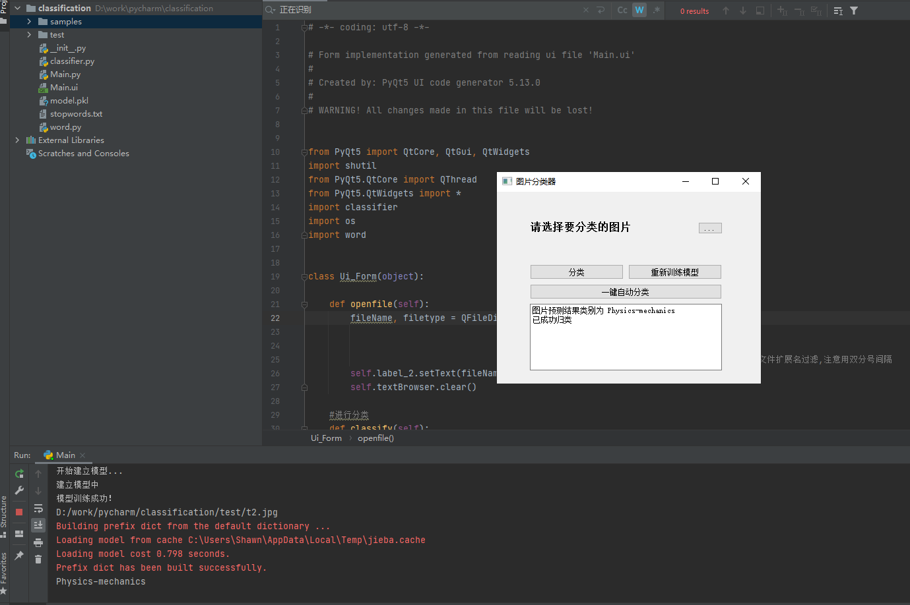

## 错题分类器

:satisfied:本程序使用`python`编写，界面使用了Pyqt5

:smiley:核心思想通过百度OCR接口将题目图片转换成文字，之后经过去停用词等操作，分词使用了tf-idf分词，分类器使用了MLP多层感知机模型，最终获得标签数据，将错题图片分类。

:neutral_face:`model.kpl`是模型文件，samples中是训练文件，test为测试文件，百度接口需要自己申请，另外界面等可以改进

-----

其中一张演示图

